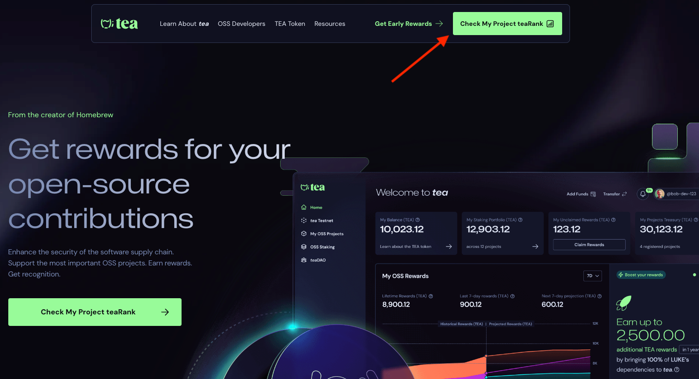
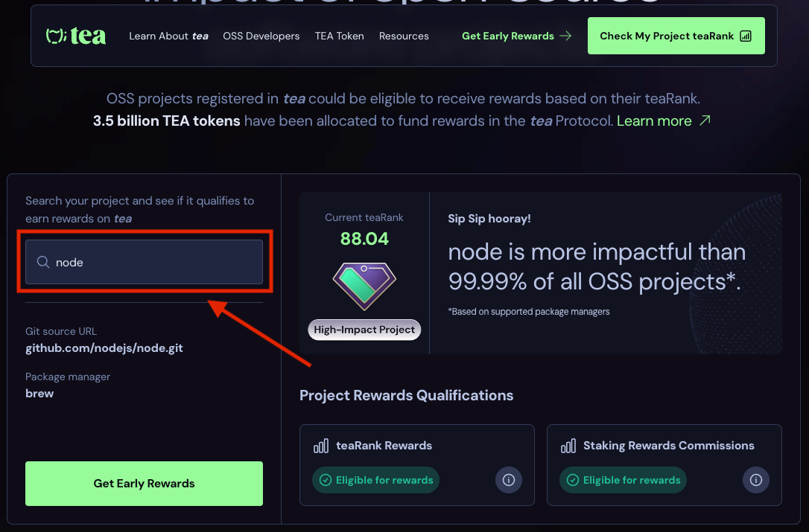
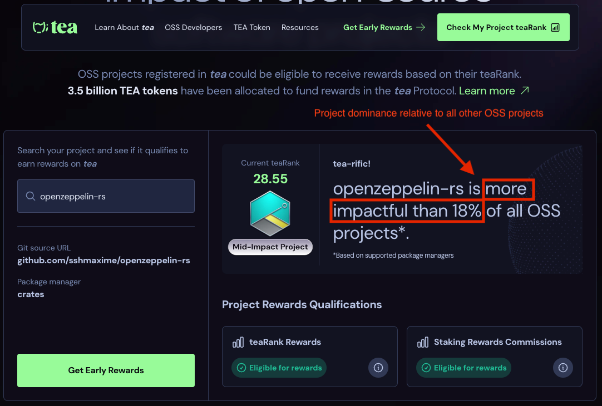

# 我可以查看我最喜爱的OSS项目Tea rank吗？

要查看开源软件项目的teaRank，

1. 在tea网站上选择“查看我的项目teaRank”。

<figure><figcaption></figcaption></figure>

2. 在搜索框中输入您最喜欢的开源软件项目的名称。

<figure><figcaption></figcaption></figure>

3. 单击您最喜欢项目的名称以可视化其属性。

<figure><figcaption></figcaption></figure>

4. 查看您最喜欢的项目的teaRank、软件包管理器、Git源URL和影响级别。

<figure><figcaption></figcaption></figure>

5. 查看您最喜欢的项目是否有资格获得teaRank奖励（\*）。

<figure><figcaption></figcaption></figure>

在我们的示例中，openzeppelin-rs有资格获得teaRank奖励。

6. 查看您最喜欢的项目是否有资格获得质押奖励佣金。

<figure><figcaption></figcaption></figure>

在我们的示例中，openzeppelin-rs有资格获得质押奖励佣金，即该项目将获得依赖它的项目所获得的质押奖励的一部分。

7. 查看您最喜欢的项目在开源生态系统中的支配地位。

<figure><figcaption></figcaption></figure>

在我们的示例中，openzeppelin-rs的影响力高于当前支持的所有软件包管理器中的18%的所有开源项目。

teaRank不仅提高了评估开源软件项目影响的准确性，还促使对贡献者进行公平且成比例的奖励分配。通过准确评估项目及其依赖关系的影响，可以相应地分配奖励，从而公平地认可和激励贡献者的贡献。

（\*）基于openzeppelin-rs的teaRank、当前依赖关系和其他项目的估算。
